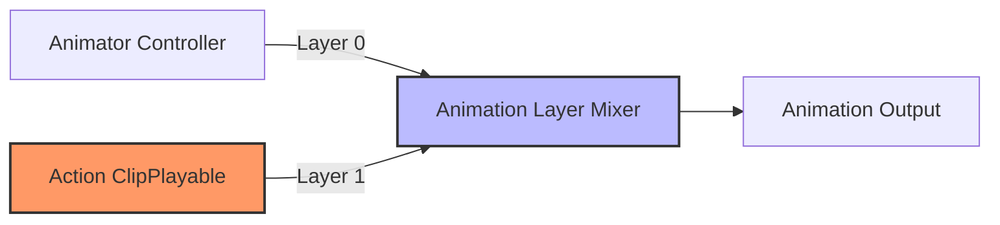

# AV.AnimationOneOff


[](https://unity.com)
[](LICENSE.md)

High-performance one-shot animation system for actions like attacks and emotes using Unity Playables.

## ✨ Features

- **One-Shot Playback**: Designed for non-looping action clips.
- **Cross-Fading**: Built-in support for blending in and out of actions.
- **Burst Compatible**: Uses Burst jobs for animation curve processing.
- **PlayableGraph**: Direct integration with Unity's PlayableGraph for performance.

## 📦 Installation

Install via Unity Package Manager (git URL).

## 🚀 Usage

1. Add `ActionAnimationComponent` to your character.
2. Use the `IActionAnimationSystem` interface to play clips.

```csharp
public class Attacker : MonoBehaviour
{
    private IActionAnimationSystem _animSystem;
    [SerializeField] private AnimationClip attackClip;

    void Start() => _animSystem = GetComponent<IActionAnimationSystem>();

    void Attack()
    {
        // Play clip with 0.1s fade in and 0.2s fade out
        _animSystem.TryPlayAction(attackClip, 0.1f, 0.2f);
    }
}
```

## ⚠️ Status

- 🧪 **Tests**: Missing.
- 📘 **Samples**: Included in `Samples~`.

## 🔍 Deep Dive

### PlayableGraph Topology
The system builds a custom PlayableGraph to mix the Animator's base output with transient action clips.

